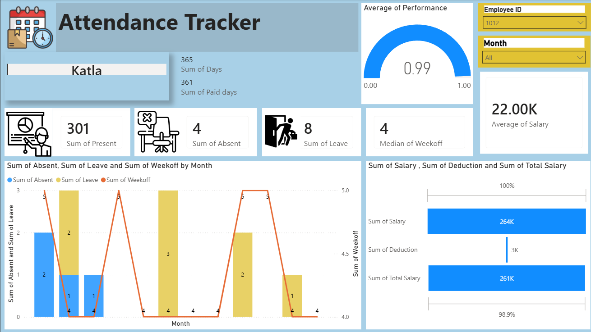
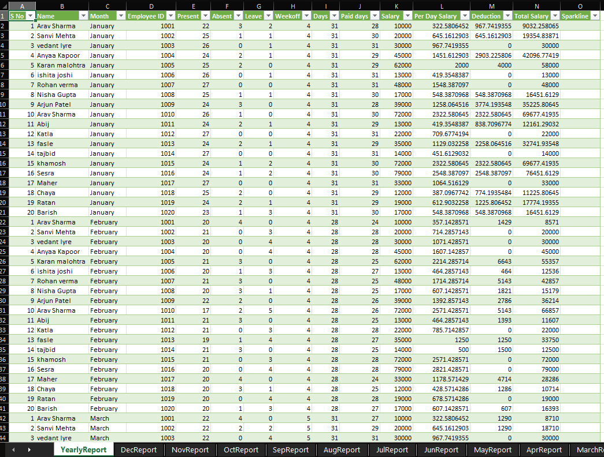

# Attendance Tracker Dashboard

A Power BI dashboard built from a monthly employee attendance sheet — tracking presence, absences, leave, and salary data for a team of 20 employees.

## What it does

The dashboard pulls from a raw Excel attendance log (daily Present/Absent/Leave/Week-off status per employee, tracked across 12 months) and summarizes it into a single interactive report page:

- **KPI cards** — Sum of Days, Sum of Paid Days, Sum of Present, Sum of Absent, Sum of Leave, Median Weekoff, Average Salary
- **Performance gauge** — Average of Performance (0–1 scale)
- **Combo chart** — Absent, Leave, and Weekoff trends by month
- **Salary breakdown** — Sum of Salary, Deductions, and Total Salary
- **Interactive filters** — Employee ID and Month slicers, so any employee's individual record can be pulled up instantly

## Dashboard Preview

## Data source

Raw data comes from a manually maintained Excel attendance sheet (one tab per month), which I cleaned and connected into Power BI to build the summary view above. Both the source Excel file and the Power BI file are included in this repo.

*Note: employee names and figures are practice/placeholder data, not real personnel records.*
